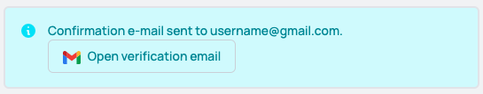

# Django Allauth Sniperlinks

django-allauth-sniperlinks is a Django app to provide sniper links,
allowing users to quickly find account verification/confirmation emails
in their inbox.

Development supported by [Subscribe Sense](https://www.subscribesense.com), which provides hosted sniper link support and other friction reduction for marketing email list signup.

The package integrates with the amazing [Django Allauth](https://github.com/pennersr/django-allauth) package.

## Quick start

1. Add `allauth_sniperlinks` to your `INSTALLED_APPS` setting **before the allauth package**  like this:
    ```python
    INSTALLED_APPS = [
        ...
        'allauth_sniperlinks',
        'allauth',
        ...
    ]
    ```

2. Add `allauth_sniperlinks.context_processors.unverified_email_sniperlinks` to the `context_processors` option in your `TEMPLATES` setting:
    ```python
    TEMPLATES = [
        {
            ...
            'OPTIONS': {
                'context_processors': [
                    ...
                    'allauth_sniperlinks.context_processors.unverified_email_sniperlinks',
                    ...
                ],
            },
            ...
        },
    ]
    ```

3. In settings, set `ACCOUNT_ADAPTER = "allauth_sniperlinks.adapter.SniperLinkAccountAdapter"`.

    If you have already overridden the account adapter to support another allauth package, you may need to create a custom account adapter that inherits from both adapters.
    
    E.g. in `myapp/adapters.py`:
    ```python

    class MyappAccountAdapter(AcceptInvitationAdapter, SniperLinkAccountAdapter):
        pass
    ```

    And in `settings.py`:
    ```python
    ACCOUNT_ADAPTER = 'myapp.adapters.MyappAccountAdapter'
    ```

4. Run `python manage.py migrate` to create the allauth_sniperlinks models.

## Features

1. Out of the box, a button with a sniper link for the email address submitted will be included in the message that appears after a verification email has been sent, e.g.: 

    

    The button will open up the users webmail browser in another tab and attempt to pull up any emails sent from the address configured by `ALLAUTH_SNIPERLINKS_VERIFICATION_SENDER`.

    You can override the display of this button by copying the file `templates/account/messages/email_confirmation_sent.txt`
    into your own template directory and changing the html directly.

    The icon will change to match the webmail provider. See `models.MailProviders` for a list of currently supported webmail providers. 

    Unsupported mail providers will not show a sniper link button.

2. A `unverified_email_banner` template tag can be included in your main template which will 
display a banner with a prompt to verify their email address and a sniper link, if they have 
an unverified email address. To access this, include `` in your template,
e.g.:

    ```html+django
    

    {# Output the unverified email banner, if applicable #}
    
    ```

    You can add classes to the banner and button link objects by passing in `banner_class` and `link_class` 
variables, like this:

    ```html+django
    
    ```

    If a user had two unverified email addresses associated with their account, this would result
    in banners similar to this appearing in the location where the tag was placed:

    

    If you wish to edit the contents of the banner, override the `templates/allauth_sniperlinks/banner.html` file in your own templates directory structure.

3. A list of all unverified emails along with sniper links and images for the appropriate 
webmail provider, if appropriate, are injected into the CONTEXT of all pages. You can access
this via the `sniperlinks` context variable, which will contain a dictionary of unverified emails for
the authenticated user, keyed by email address, with each value represented as another dictionary with
keys of `link` with the URL for the sniper link and `img` with the path to the image for
their webmail provider's icon.

    For example, in a template, accesssing the `{{ sniperlinks }}` context variable will provide 
    something like this:
    ```python
    {
      'test@gmail.com' : {
        'link': 'https://mail.google.com/mail/u/0/#search/from%3A%40mydomain.com%3E+in%3Aanywhere',
        'img': '/static/allauth_sniperlinks/provider_icons/Gsuite.svg',
      }
    }
    ```

    Note that the context variable is cached so that each page display does not require a
    database query. The cache entry for the user is invalidated whenever a new email address
    for the user is added or an existing one is changed in some way.

## Settings

* `ALLAUTH_SNIPERLINKS_VERIFICATION_SENDER`
    Set the email used to send verification senders. This is used when creating sniper links, see features section above for an example.
    
    Defaults to `settings.DEFAULT_FROM_EMAIL`.

* `ALLAUTH_SNIPERLINKS_BANNER_ONLY_PRIMARY`
    If `True`, then the `unverified_email_banner` template tag will only create a banner for an unverified address if it is the primary one. Otherwise, multiple banners may appear for each unverified email address associated with the account.

    Defaults to `True`.

## Management Commands

* `python manage.py clear_sniperlink_cache`
    This command will clear out the sniperlink cache used by the context processor. It does this by incrementing a version number used for all sniperlink cache entries. Otherwise, all sniperlink cache entries for users have a timeout of 5 minutes.

    This may be useful if you change the `ALLAUTH_SNIPERLINKS_BANNER_ONLY_PRIMARY` setting and don't want to wait for the 5 minute timeout for the banners to update.
